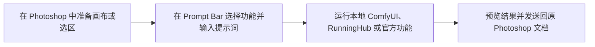

# Vplugins 功能介绍与使用说明

Vplugins 是一个配合 Adobe Photoshop 使用的 AI 图像工作流工具。它在 Photoshop 旁显示一个轻量 Prompt Bar，可以读取当前文档、选区和参考图，将任务发送到本地 ComfyUI、RunningHub 或 Vplugins 官方功能，再把生成结果作为新图层放回 Photoshop。

本文面向日常使用者。开发、构建和架构说明请阅读项目根目录的 [README](../README.md)。

> 第一次使用 Vplugins？先阅读更精简的 [新手快速上手](Vplugins新手快速上手.md)。

## 1. 核心功能

Vplugins 将 Photoshop 的画布与选区直接接入 AI 工作流，减少导出、上传、下载和手动对齐的重复操作。一次典型任务的流程是：



| 功能 | 说明 |
| --- | --- |
| AI 功能菜单 | 从 Prompt Bar 左侧 `+` 选择已启用的本地、RunningHub 或官方功能。 |
| 文生图与图像编辑 | 输入提示词，并将当前 Photoshop 画布、选区或参考图交给所选工作流。具体能力由功能本身的 workflow 决定。 |
| 参考图 | 最多添加 5 张本地图片或 Photoshop 选区预览；可拖动调整传入顺序。 |
| 选区裁剪与精确放回 | 将 Photoshop 选区作为局部处理范围；结果会保留原选区定位信息，便于放回正确位置。 |
| 分辨率、批量与强度 | 可选择 `1k / 2k / 4k`、1～4 张生成数量，以及工作流支持时的强度。 |
| 本地 ComfyUI | 支持启动、停止、检查本地 ComfyUI Bridge，扫描并启用兼容的 API workflow。 |
| RunningHub | 支持配置 AI 站或 CN 站 API Key、导入 App ID / WebApp ID，并运行已导入的云端工作流。 |
| 结果管理 | 支持预览、多选结果，并将选中的结果作为新图层或智能对象发送回 Photoshop。 |
| 功能展示管理 | 在设置中启用、排序、改图标，并决定功能显示在主菜单还是侧边栏。 |

## 2. 使用前准备

### 必备环境

- Windows 10/11。
- Adobe Photoshop 24.0 或更高版本。
- Vplugins Windows 桌面端。
- 与桌面端版本一致的 Vplugins Photoshop Bridge `.ccx`。

还需要至少准备一种图片工作流来源：

| 工作流来源 | 需要准备 | 适用情况 |
| --- | --- | --- |
| RunningHub | AI 站或 CN 站账号、对应 API Key、可用余额、已发布或可导入的 App ID | 不想在本机运行模型 |
| 本地 ComfyUI Bridge | ComfyUI Windows Portable、所需模型和节点、`comfyui-ps-bridge-nodes`、兼容的 API workflow | 希望本机运行、自主管理模型 |
| Vplugins 官方功能 | Vplugins 登录账号、有效套餐或功能权限，部分功能还需要 RunningHub 连接 | 使用官方维护的功能目录 |

用户自己导入的 RunningHub 功能使用自己的 RunningHub API Key；用户自己导入的本地功能不要求 Vplugins 会员。

## 3. 安装与首次连接

### 正式版安装

1. 运行 Vplugins Windows 安装包。
2. 双击与桌面端版本一致的 `.ccx`，按 Creative Cloud Desktop 提示安装 Photoshop Bridge。
3. 启动 Photoshop，并打开或新建一个文档。
4. 启动 Vplugins。
5. 在 Photoshop 的 Vplugins 插件菜单中选择 **Prompt Bar**。

直接分发的 `.ccx` 可能显示 Adobe 的未验证插件提示，请只安装来自可信发布渠道且版本一致的文件。

### 开发版加载

开发环境不要把 `uxp-bridge` 目录压缩后改名为 `.ccx`。应使用 Adobe UXP Developer Tool：

1. 选择 Add Plugin。
2. 选中仓库中的 `uxp-bridge/manifest.json`。
3. 启动 Photoshop 后点击 Load。

### 判断是否连接成功

桌面端会通过 `ws://127.0.0.1:9527` 等待 Photoshop Bridge。连接成功后，Prompt Bar 可以读取当前 Photoshop 文档、选区和画布；连接失败时，运行任务会提示 Photoshop Bridge 未连接。

如果关闭 Prompt Bar，Vplugins 会隐藏到 Windows 系统托盘，不会立即退出。可以：

- 双击托盘图标重新打开。
- 在托盘菜单中打开设置。
- 在托盘菜单中控制是否显示侧边栏。
- 选择“退出 Vplugins”完全退出。

## 4. 配置工作流

### 4.1 配置 RunningHub

1. 打开 **设置 → RunningHub**。
2. 选择 **AI站** 或 **CN站**。
3. 在对应卡片中填写该站点的 API Key。
4. 点击 **验证/刷新**。
5. 确认页面显示账号、余额和当前站点。
6. 打开 **设置 → 功能录入**。
7. 在“导入 RunningHub”中选择相同站点，填写 `appId` 或 `webappId`。
8. 点击 **导入 App ID**。
9. 打开 **设置 → 功能展示**，刷新功能列表，启用需要的功能，并设置排序和显示位置。

注意事项：

- AI 站与 CN 站的 API Key 分开保存，导入和运行时必须匹配站点。
- CN 站 Key 修改后，需要先在 RunningHub 页重新验证。
- RunningHub 会产生真实上传和任务调用，可能消耗 RH 币或钱包余额。
- 工作流应先在 RunningHub 中保存并成功运行一次，否则平台可能返回“工作流尚未保存或运行”。

### 4.2 配置本地 ComfyUI Bridge

1. 确认 ComfyUI 已安装 `comfyui-ps-bridge-nodes` 及 workflow 需要的模型和节点。
2. 打开 **设置 → 本地 ComfyUI → 设置**。
3. 填写 Base URL，默认是 `http://127.0.0.1:8188`。
4. 填写 ComfyUI Windows Portable 根目录，例如：

   ```text
   C:\ComfyUI_windows_portable
   ```

5. 根据需要启用“节点管理器”或“ComfyUI 浏览器”。
6. 点击 **启动**，等待状态变成“已连接”。
7. 如启动失败，切换到“命令行”查看日志。
8. 打开 **设置 → 功能录入**，填写 **API workflow JSON 目录**。
9. 打开 **设置 → 功能展示**，刷新功能列表并启用需要的功能。

兼容的本地 workflow 应满足：

- 使用 API-format JSON，而不是只用于 ComfyUI 前端显示的普通 workflow JSON。
- 包含 `Adv_Request`、`adv_request` 或 `VpluginsRequest` 统一请求节点。
- 包含 `Adv_SendToPS` 或 `Send To PS` 终端输出节点。
- workflow 中使用的自定义节点、模型、VAE 和其他资源已经安装。

目录扫描会跳过不符合结构的 JSON，并在“功能录入”页显示跳过原因。

### 4.3 登录并使用官方功能

1. 打开 **设置 → 用户登录**。
2. 使用邮箱和密码登录，或选择 Google 登录。
3. 等待账号和会员权限同步完成。
4. 打开 **设置 → 功能展示**，查看官方功能。
5. 如果官方功能还需要 RunningHub，请先完成对应站点的 RunningHub 配置。

官方功能可能因以下原因锁定：

- 尚未登录。
- 当前套餐不包含该功能。
- 订阅已过期。
- 权限目录暂时无法同步。
- 需要的 RunningHub 连接尚未完成。

“仙宫云”页面目前是功能占位，不能用于真实任务。

## 5. 认识 Prompt Bar

Prompt Bar 从左到右包含：

| 控件 | 作用 |
| --- | --- |
| `+` | 打开功能菜单 |
| 功能标签 | 显示当前选中的功能 |
| 图片按钮 | 添加或清空参考图 |
| 裁剪按钮 | 使用当前 Photoshop 选区进行裁剪捕获和定位 |
| 强度 | 为支持该参数的 workflow 设置强度；可以单独启用或关闭 |
| `1k / 2k / 4k` | 选择目标分辨率 |
| `1 / 2 / 3 / 4` | 选择生成张数 |
| 圆形运行按钮 | 开始任务；运行中再次点击会取消任务 |

输入区域用于填写提示词。功能的实际输入能力由导入的 workflow 决定，因此不是每个功能都会使用全部参数。

## 6. 完成一次生成

1. 在 Photoshop 中打开目标文档，并确认它是当前活动文档。
2. 点击 Prompt Bar 左侧的 `+`，选择功能。
3. 输入提示词。
4. 按需添加参考图。
5. 按需创建 Photoshop 选区并开启裁剪。
6. 设置强度、分辨率和生成张数。
7. 点击运行按钮，或在 Vplugins 主功能区聚焦时按 `Ctrl+Enter`。
8. 等待状态依次经过“正在读取画布”“正在上传”“运行中”“已完成”。
9. 在结果条中点击一张或多张结果。
10. 点击 **发送到PS**。

Vplugins 会尽量把结果放回任务开始时的目标文档。裁剪模式下，结果会使用捕获阶段保存的 `placement_bounds` 对齐原选区，而不是依赖放回瞬间的当前选区。

不要在任务运行期间关闭目标 Photoshop 文档。切换到其他文档通常不会改变本次任务的目标，但目标文档被关闭后无法安全放回。

## 7. 参考图与裁剪

### 参考图

- 最多添加 5 张。
- 可以一次选择多张本地图片。
- Photoshop 中存在选区时，参考图按钮会优先添加当前选区预览；没有选区时会打开文件选择器。
- 参考图可以拖动调整顺序，传入 workflow 时会按界面顺序编号。
- 再次关闭参考图区域会清空当前参考图。

### 裁剪模式

裁剪模式适合局部重绘、选区生成和需要精确放回原位置的任务。

1. 先在 Photoshop 中创建有效选区。
2. 再打开 Prompt Bar 的裁剪按钮。
3. 运行任务前不要关闭目标文档。

如果 workflow 要求 mask，而 Photoshop 没有有效选区，任务会失败并提示创建选区。

## 8. 结果与取消

- 任务运行中，圆形运行按钮会显示进度 halo 和停止方块。
- 再次点击运行按钮可请求取消当前 provider 的任务。
- RunningHub 取消会访问真实云端任务；任务已进入平台终态时可能无法再取消。
- 生成成功后可以多选结果，再一次性发送到 Photoshop。
- 放回的结果会创建新图层或智能对象，并尽量使用功能名作为图层名前缀。
- 如果 Photoshop 此时未连接，结果可能仍已生成，但不能直接放回；恢复 Bridge 连接后再重试放回。

## 9. 功能展示管理

在 **设置 → 功能展示** 中可以：

- 刷新本地、RunningHub 和官方功能列表。
- 启用或停用功能。
- 修改功能图标。
- 调整显示顺序。
- 决定功能放在主功能菜单还是侧边栏。
- 保存、导入和导出功能展示方案。

功能展示方案用于迁移功能布局和工作流引用，不包含 RunningHub API Key。导入包含本地功能的方案前，应先在新电脑上配置并扫描对应的本地 workflow 目录。

## 10. 更新软件

正式发布版可以在 **设置 → 关于软件** 中检查更新。开发版通常会提示自动更新不可用。

桌面端和 Photoshop Bridge 是两个安装包：

- 桌面端更新后，应确认 Photoshop Bridge 的 `.ccx` 版本是否也需要更新。
- 如果出现“Photoshop 仍在运行旧版 UXP Bridge”，请重新安装或在 UXP Developer Tool 中重新加载对应版本。

## 11. 常见问题

### Prompt Bar 显示“PS 未连接”

依次检查：

1. Photoshop 是否已启动。
2. Photoshop Bridge 是否已安装并加载。
3. 桌面端和 `.ccx` 是否为同一版本。
4. 是否有旧 Vplugins 实例或其他程序占用 `127.0.0.1:9527`。
5. 开发环境中是否已在 UXP Developer Tool 点击 Load 或 Reload。

### 看不到任何功能

1. 打开“功能录入”，确认 RunningHub App 或本地 workflow 已成功录入。
2. 打开“功能展示”，点击刷新功能列表。
3. 确认目标功能处于启用状态。
4. 本地功能还要确认 workflow 目录正确且 JSON 没有被扫描器跳过。

### 本地 ComfyUI 显示“未连接”

1. 检查 Base URL，默认端口是 `8188`。
2. 检查 ComfyUI 根目录是否指向 Windows Portable 顶层目录。
3. 在“命令行”页检查启动日志。
4. 确认 `comfyui-ps-bridge-nodes` 已安装，并且 `/ps-bridge/health` 可访问。
5. 检查防火墙、端口冲突和 ComfyUI 启动错误。

### 本地任务完成但没有结果

确认 workflow 使用 `Adv_SendToPS` 或 `Send To PS` 作为 Photoshop 输出节点。普通 Preview Image 或 Save Image 节点不会自动被当作 Vplugins 的最终输出。

### RunningHub 常见错误

| 错误码 | 含义与处理 |
| --- | --- |
| `416` | 余额不足，充值后重试 |
| `421` / `1520` | 并发达到上限，等待已有任务完成 |
| `802` / `1002` | API Key 无效或失效，回到设置更新并重新验证 |
| `810` | workflow 尚未保存或运行，先在 RunningHub 中成功运行一次 |
| `901` | App 不存在，检查站点和 App ID |
| `1501` | 内容审核未通过，调整提示词或输入图片 |

### 裁剪结果位置不正确

1. 在开始任务前创建选区并开启裁剪。
2. 运行期间不要关闭目标文档。
3. 确认 Photoshop Bridge 已更新到与桌面端一致的版本。
4. 如果错误持续，记录目标文档尺寸、选区范围和错误提示，交给开发者检查 `placement_bounds` 链路。

### `Ctrl+Enter` 没有反应

`Ctrl+Enter` 只在 Vplugins 主功能区窗口聚焦时触发。运行中按同一快捷键会请求取消。Photoshop 聚焦时，该组合键仍由 Photoshop 处理。

## 12. 隐私、密钥与费用

- 不要把 RunningHub API Key 发给不可信人员，也不要把它写进截图、workflow 名称或提示词。
- Vplugins 功能展示方案不会导出 API Key，但手工复制设置文件仍可能暴露本机配置。
- RunningHub 的余额查询、上传、运行和取消都会访问真实账号。
- 本地 ComfyUI 的模型许可、素材使用权和显存消耗由用户自行管理。
- 处理客户素材前，请确认所选云端 provider、模型和账号符合项目的隐私与授权要求。
